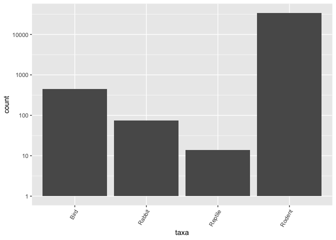
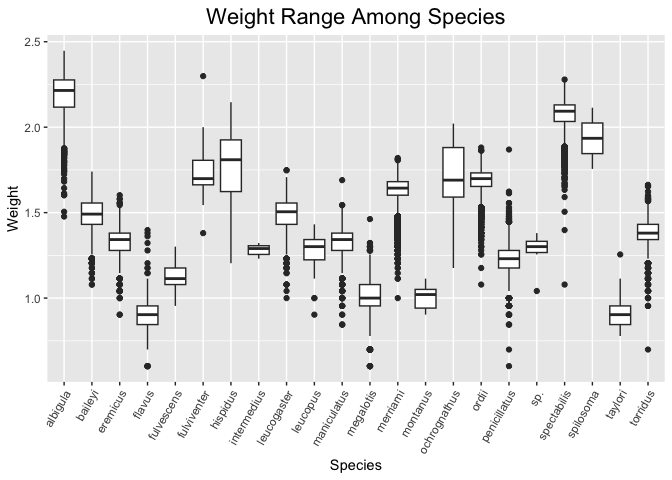
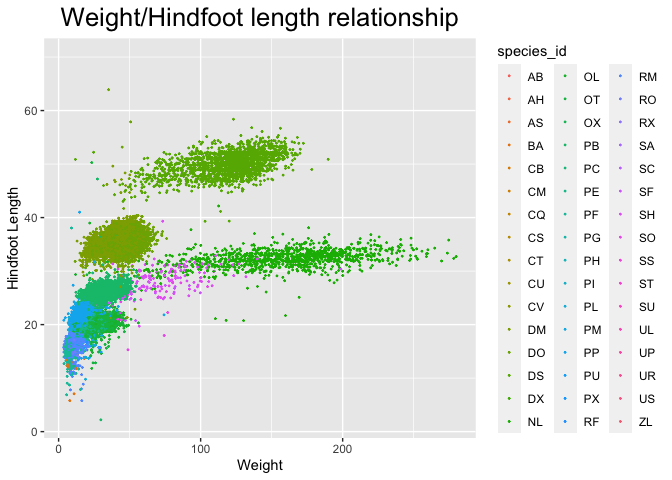
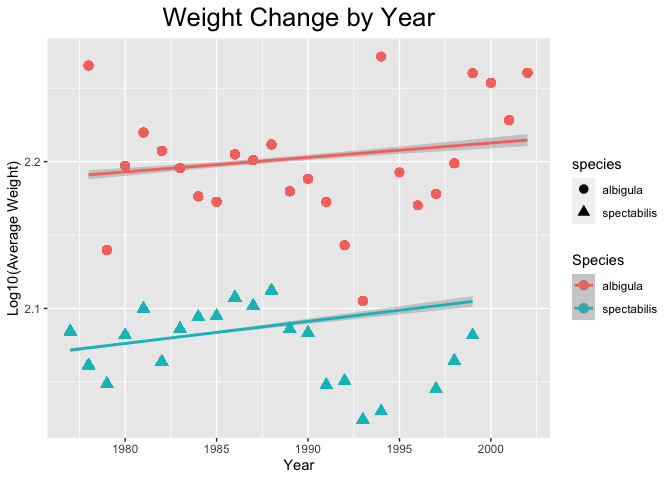

## Instructions
Answer the following questions and complete the exercises in RMarkdown. Please embed all of your code and push your final work to your repository. Your final lab report should be organized, clean, and run free from errors. Remember, you must remove the `#` for the included code chunks to run. Be sure to add your name to the author header above. For any included plots, make sure they are clearly labeled. You are free to use any plot type that you feel best communicates the results of your analysis.  

Make sure to use the formatting conventions of RMarkdown to make your report neat and clean!  

## Load the libraries

```r
library(tidyverse)
library(janitor)
library(naniar)
```

## Desert Ecology
For this assignment, we are going to use a modified data set on [desert ecology](http://esapubs.org/archive/ecol/E090/118/). The data are from: S. K. Morgan Ernest, Thomas J. Valone, and James H. Brown. 2009. Long-term monitoring and experimental manipulation of a Chihuahuan Desert ecosystem near Portal, Arizona, USA. Ecology 90:1708.

```r
deserts <- read_csv("data/surveys_complete.csv") %>% clean_names()
```

```
## Rows: 34786 Columns: 13
## ── Column specification ────────────────────────────────────────────────────────
## Delimiter: ","
## chr (6): species_id, sex, genus, species, taxa, plot_type
## dbl (7): record_id, month, day, year, plot_id, hindfoot_length, weight
## 
## ℹ Use `spec()` to retrieve the full column specification for this data.
## ℹ Specify the column types or set `show_col_types = FALSE` to quiet this message.
```

1. Use the function(s) of your choice to get an idea of its structure, including how NA's are treated. Are the data tidy?  

```r
summary(deserts)
```

```
##    record_id         month             day            year         plot_id     
##  Min.   :    1   Min.   : 1.000   Min.   : 1.0   Min.   :1977   Min.   : 1.00  
##  1st Qu.: 8964   1st Qu.: 4.000   1st Qu.: 9.0   1st Qu.:1984   1st Qu.: 5.00  
##  Median :17762   Median : 6.000   Median :16.0   Median :1990   Median :11.00  
##  Mean   :17804   Mean   : 6.474   Mean   :16.1   Mean   :1990   Mean   :11.34  
##  3rd Qu.:26655   3rd Qu.:10.000   3rd Qu.:23.0   3rd Qu.:1997   3rd Qu.:17.00  
##  Max.   :35548   Max.   :12.000   Max.   :31.0   Max.   :2002   Max.   :24.00  
##                                                                                
##   species_id            sex            hindfoot_length     weight      
##  Length:34786       Length:34786       Min.   : 2.00   Min.   :  4.00  
##  Class :character   Class :character   1st Qu.:21.00   1st Qu.: 20.00  
##  Mode  :character   Mode  :character   Median :32.00   Median : 37.00  
##                                        Mean   :29.29   Mean   : 42.67  
##                                        3rd Qu.:36.00   3rd Qu.: 48.00  
##                                        Max.   :70.00   Max.   :280.00  
##                                        NA's   :3348    NA's   :2503    
##     genus             species              taxa            plot_type        
##  Length:34786       Length:34786       Length:34786       Length:34786      
##  Class :character   Class :character   Class :character   Class :character  
##  Mode  :character   Mode  :character   Mode  :character   Mode  :character  
##                                                                             
##                                                                             
##                                                                             
## 
```


```r
deserts  %>%
  summarise_all(~ sum(is.na(.)))
```

```
## # A tibble: 1 × 13
##   record_id month   day  year plot_id species_id   sex hindfoot_length weight
##       <int> <int> <int> <int>   <int>      <int> <int>           <int>  <int>
## 1         0     0     0     0       0          0  1748            3348   2503
## # ℹ 4 more variables: genus <int>, species <int>, taxa <int>, plot_type <int>
```


```r
names(deserts)
```

```
##  [1] "record_id"       "month"           "day"             "year"           
##  [5] "plot_id"         "species_id"      "sex"             "hindfoot_length"
##  [9] "weight"          "genus"           "species"         "taxa"           
## [13] "plot_type"
```

```r
options(scipen=999)#cancels scientific notation for the session
```


2. How many genera and species are represented in the data? What are the total number of observations? Which species is most/ least frequently sampled in the study?

```r
num_genera <- deserts %>% 
  distinct(genus) %>% 
  nrow()

num_species <- deserts %>% 
  distinct(species) %>% 
  nrow()

total_observations <- nrow(deserts)

sampled_species <- deserts %>% 
  count(species) %>% 
  summarize(
    most_sampled_species = species[which.max(n)],
    max_count = max(n),
    least_sampled_species = species[which.min(n)],
    min_count = min(n)
  )
```


```
## Number of genera: 26
```

```
## Number of species: 40
```

```
## Total number of observations: 34786
```

```
## Most frequently sampled species: merriami with count: 10596
```

```
## Least frequently sampled species: clarki with count: 1
```


```r
deserts %>%
  group_by(species) %>%
  count(species, name = "Observation_Count") %>% #interesting that only if you give the count name, only then it will allow to use "fill"
  arrange(desc(Observation_Count)) %>%
  ggplot(aes(x = reorder(species, Observation_Count), y = Observation_Count, fill = species)) +
  geom_col() +
  coord_flip() +
  scale_y_log10() +
  labs(title = "Frequency of Observations by Species", 
       x = "Species",
       y = "Observation Count")
```

<!-- -->


3. What is the proportion of taxa included in this study? Show a table and plot that reflects this count.

```r
deserts %>% 
  ggplot(aes(taxa))+
  geom_bar()+
  scale_y_log10()+
  theme(axis.text.x=element_text(angle = 60, hjust= 1))
```

<!-- -->


4. For the taxa included in the study, use the fill option to show the proportion of individuals sampled by `plot_type.`

```r
deserts %>% 
  ggplot(aes(x = taxa, fill= plot_type))+
  geom_bar(position = "dodge")+
  scale_y_continuous(labels = scales::percent)+
  scale_y_log10()+
  labs(tittle= "Taxa by Plot Type", x="Taxa")
```

```
## Scale for y is already present.
## Adding another scale for y, which will replace the existing scale.
```

<!-- -->


5. What is the range of weight for each species included in the study? Remove any observations of weight that are NA so they do not show up in the plot.

```r
deserts %>% 
  filter(weight != "NA") %>%
  ggplot(aes(x=species, y=log10(weight)))+
  geom_boxplot()+
   labs(title="Weight Range Among Species",
        y= "Weight", 
       x="Species")+
  theme(axis.text.x=element_text(angle = 60, hjust= 1), plot.title = element_text(size = rel(1.5), hjust = 0.5))
```

<!-- -->


6. Add another layer to your answer from #5 using `geom_point` to get an idea of how many measurements were taken for each species.

```r
deserts %>% 
  filter(weight != "NA") %>%
  ggplot(aes(x=species, y=log10(weight)))+
  geom_boxplot()+
   labs(title="Weight Range Among Species",
        y= "Weight", 
       x="Species")+
  theme(axis.text.x=element_text(angle = 60, hjust= 1), plot.title = element_text(size = rel(1.5), hjust = 0.5))+
  geom_point(size=0.45) 
```

<!-- -->


7. [Dipodomys merriami](https://en.wikipedia.org/wiki/Merriam's_kangaroo_rat) is the most frequently sampled animal in the study. How have the number of observations of this species changed over the years included in the study?

```r
deserts %>%
  filter(species == "merriami") %>%
  group_by(year) %>%
  count(species) %>%
  ggplot(aes(x=year, y=n))+
  geom_point()+ 
  geom_smooth(method=lm, se=T)+
  labs(title="Observations by Year", 
       x="Year",
       y="Number of Observations")+
  theme(plot.title = element_text(size = rel(1.75), hjust = 0.5))
```

```
## `geom_smooth()` using formula = 'y ~ x'
```

<!-- -->


8. What is the relationship between `weight` and `hindfoot` length? Consider whether or not over plotting is an issue.

```r
deserts %>%
  ggplot(aes(x=weight, y=hindfoot_length))+
  geom_jitter(na.rm = T, aes(color = species_id), size=0.25)+
   labs(title="Weight/Hindfoot length relationship", 
       x="Weight",
       y="Hindfoot Length")+
  theme(plot.title = element_text(size = rel(1.75), hjust = 0.5))
```

<!-- -->


9. Which two species have, on average, the highest weight? Once you have identified them, make a new column that is a ratio of `weight` to `hindfoot_length`. Make a plot that shows the range of this new ratio and fill by sex.

```r
deserts %>%
  filter(weight != "NA") %>%
  group_by(species) %>%
  summarise(mean_weight = mean(weight, na.rm=T)) %>%
  ggplot(aes(x=reorder(species, mean_weight), y=mean_weight))+
  geom_col()+
  coord_flip()+
  scale_y_log10()
```

<!-- -->

```r
deserts %>%
  filter(!is.na(weight) & !is.na(hindfoot_length) & !is.na(sex)) %>%
  mutate(weight_to_hindfoot_ratio = weight / hindfoot_length) %>%
  filter(species %in% c("albigula", "spectabilis")) %>%
  ggplot(aes(x = weight_to_hindfoot_ratio, fill = sex)) +
  geom_histogram(binwidth = 0.15, position = "dodge") +
  labs(title = "Weight/Hindfoot length relationship", 
       x = "Weight/Hindfoot length ratio",
       y = "samples") +
  theme(plot.title = element_text(size = rel(1.75), hjust = 0.5))
```

<!-- -->

```r
deserts %>%
  filter(!is.na(weight) & !is.na(hindfoot_length) & !is.na(sex)) %>%
  mutate(weight_to_hindfoot_ratio = weight / hindfoot_length) %>%
  filter(species %in% c("albigula", "spectabilis")) %>%
  arrange(desc(weight_to_hindfoot_ratio))
```

```
## # A tibble: 3,068 × 14
##    record_id month   day  year plot_id species_id sex   hindfoot_length weight
##        <dbl> <dbl> <dbl> <dbl>   <dbl> <chr>      <chr>           <dbl>  <dbl>
##  1     12871     5    28  1987       2 NL         M                  32    278
##  2     33049    11    17  2001      12 NL         M                  33    280
##  3     12729     4    26  1987       2 NL         M                  32    270
##  4      2133    10    25  1979       2 NL         F                  33    274
##  5     12299     2     1  1987       2 NL         M                  32    253
##  6     13025     7     1  1987       2 NL         M                  33    260
##  7     31862     3    24  2001       2 NL         F                  32    252
##  8      8869     2     5  1984      15 NL         M                  33    259
##  9     12458     3     2  1987       2 NL         M                  33    259
## 10     30175     1     8  2000       2 NL         M                  34    265
## # ℹ 3,058 more rows
## # ℹ 5 more variables: genus <chr>, species <chr>, taxa <chr>, plot_type <chr>,
## #   weight_to_hindfoot_ratio <dbl>
```


10. Make one plot of your choice! Make sure to include at least two of the aesthetics options you have learned.

```r
deserts %>%
  group_by(year, species) %>%
  filter(!is.na(weight) & !is.na(sex)) %>%
  filter(species %in% c("albigula", "spectabilis")) %>%
  summarize(avg_weight = mean(weight, na.rm = TRUE)) %>%
  ggplot(aes(x = year, y = log10(avg_weight))) +
  geom_point(aes(color = species, shape = species), size = 3) + 
  geom_smooth(method = "lm", se = TRUE) +
  labs(title = "Weight Change by Year", 
       x = "Year",
       y = "Log10(Average Weight)") +
  theme(plot.title = element_text(size = rel(1.75), hjust = 0.5))
```

```
## `summarise()` has grouped output by 'year'. You can override using the
## `.groups` argument.
## `geom_smooth()` using formula = 'y ~ x'
```

<!-- -->


```r
deserts %>%
  filter(!is.na(weight) & !is.na(sex) & species %in% c("albigula", "spectabilis")) %>% #important to filter first, I want to get two lines
  group_by(year, species) %>%
  mutate(avg_weight = mean(weight, na.rm = TRUE)) %>%
  ggplot(aes(x = year, y = log10(avg_weight), color = species)) +
  geom_point(aes(color = species, shape = species), size = 3) + 
  geom_smooth(method = "lm", se = TRUE) +
  labs(title = "Weight Change by Year", 
       x = "Year",
       y = "Log10(Average Weight)",
       color = "Species") +
  theme(plot.title = element_text(size = rel(1.75), hjust = 0.5))
```

```
## `geom_smooth()` using formula = 'y ~ x'
```

<!-- -->


## Push your final code to GitHub!
Please be sure that you check the `keep md` file in the knit preferences. 
