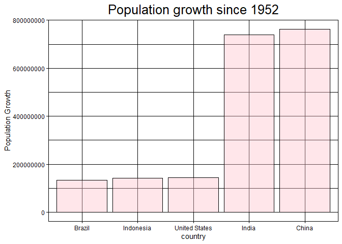

## Instructions

Answer the following questions and complete the exercises in RMarkdown. Please embed all of your code and push your final work to your repository. Your final lab report should be organized, clean, and run free from errors. Remember, you must remove the `#` for the included code chunks to run. Be sure to add your name to the author header above. For any included plots, make sure they are clearly labeled. You are free to use any plot type that you feel best communicates the results of your analysis.

**In this homework, you should make use of the aesthetics you have learned. It's OK to be flashy!**

Make sure to use the formatting conventions of RMarkdown to make your report neat and clean!

## Load the libraries


```r
library(tidyverse)
library(janitor)
library(here)
library(naniar)
```


```r
options(scipen = 999)
```

## Resources

The idea for this assignment came from [Rebecca Barter's](http://www.rebeccabarter.com/blog/2017-11-17-ggplot2_tutorial/) ggplot tutorial so if you get stuck this is a good place to have a look.

## Gapminder

For this assignment, we are going to use the dataset [gapminder](https://cran.r-project.org/web/packages/gapminder/index.html). Gapminder includes information about economics, population, and life expectancy from countries all over the world. You will need to install it before use. This is the same data that we will use for midterm 2 so this is good practice.


```r
#install.packages("gapminder")
library("gapminder")
```

## Questions

The questions below are open-ended and have many possible solutions. Your approach should, where appropriate, include numerical summaries and visuals. Be creative; assume you are building an analysis that you would ultimately present to an audience of stakeholders. Feel free to try out different `geoms` if they more clearly present your results.

**1. Use the function(s) of your choice to get an idea of the overall structure of the data frame, including its dimensions, column names, variable classes, etc. As part of this, determine how NAs are treated in the data.**


```r
gapminder <- gapminder
```


```r
summary(gapminder)
```

```
##         country        continent        year         lifeExp     
##  Afghanistan:  12   Africa  :624   Min.   :1952   Min.   :23.60  
##  Albania    :  12   Americas:300   1st Qu.:1966   1st Qu.:48.20  
##  Algeria    :  12   Asia    :396   Median :1980   Median :60.71  
##  Angola     :  12   Europe  :360   Mean   :1980   Mean   :59.47  
##  Argentina  :  12   Oceania : 24   3rd Qu.:1993   3rd Qu.:70.85  
##  Australia  :  12                  Max.   :2007   Max.   :82.60  
##  (Other)    :1632                                                
##       pop               gdpPercap       
##  Min.   :     60011   Min.   :   241.2  
##  1st Qu.:   2793664   1st Qu.:  1202.1  
##  Median :   7023596   Median :  3531.8  
##  Mean   :  29601212   Mean   :  7215.3  
##  3rd Qu.:  19585222   3rd Qu.:  9325.5  
##  Max.   :1318683096   Max.   :113523.1  
## 
```


**2. Among the interesting variables in gapminder is life expectancy. How has global life expectancy changed between 1952 and 2007?**


```r
gapminder %>%
  group_by(year) %>%
  ggplot(aes(x = year, y =lifeExp)) +
  geom_col() +
  
  labs(title = "Life Exp per year", 
       x = "Year",
       y = "Life Exp") 
```

<!-- -->

**3. How do the distributions of life expectancy compare for the years 1952 and 2007?**


```r
gapminder %>%
  filter(year %in% c(1952, 2007)) %>%
  #group_by(year) %>%
  #mutate(quartile = ntile(lifeExp, 4)) %>% #here I am adding how many qurtiles in he each box I want to have
  ggplot(aes(x = factor(year), y = lifeExp)) + #here I made conversion of the year into factor
  geom_boxplot(color="black", fill="pink", alpha=0.4) +
  
  labs(title = "Life Expectancy Quartiles Comparison between 1952 and 2007",
       y = "Life Expectancy",
       x = "Year") +
  theme(axis.text.x = element_text(angle = 60, hjust = 1),
        plot.title = element_text(size = rel(1.5), hjust = 0.5))
```

<!-- -->

**4. Your answer above doesn't tell the whole story since life expectancy varies by region. Make a summary that shows the min, mean, and max life expectancy by continent for all years represented in the data.**


```r
gapminder %>%
  group_by(year, continent) %>%
  summarize(min_lifeExp = min(lifeExp),
            mean_lifeExp = mean(lifeExp),
            max_lifeExp = max(lifeExp), .groups='keep') #keep to get rid of the second window
```

```
## # A tibble: 60 × 5
## # Groups:   year, continent [60]
##     year continent min_lifeExp mean_lifeExp max_lifeExp
##    <int> <fct>           <dbl>        <dbl>       <dbl>
##  1  1952 Africa           30           39.1        52.7
##  2  1952 Americas         37.6         53.3        68.8
##  3  1952 Asia             28.8         46.3        65.4
##  4  1952 Europe           43.6         64.4        72.7
##  5  1952 Oceania          69.1         69.3        69.4
##  6  1957 Africa           31.6         41.3        58.1
##  7  1957 Americas         40.7         56.0        70.0
##  8  1957 Asia             30.3         49.3        67.8
##  9  1957 Europe           48.1         66.7        73.5
## 10  1957 Oceania          70.3         70.3        70.3
## # ℹ 50 more rows
```

```r
  #ggplot(aes(x = factor(year), y = mean_lifeExp, fill = continent)) +
  #geom_bar(stat = "identity") +
  #labs(title = "Summary of Life Expectancy by Continent",
       #y = "Mean Life Expectancy",
       #x = "Year",
       #fill = "Continent") +
 # theme(axis.text.x = element_text(angle = 60, hjust = 1),
      #  plot.title = element_text(size = rel(1.5), hjust = 0.5))
```

**5. How has life expectancy changed between 1952-2007 for each continent?**


```r
gapminder %>%
  group_by(year, continent) %>%
  summarise(mean_life_exp = mean(lifeExp), .groups='keep') %>% #do NOT use muatate 
  ggplot(aes(x = factor(year), y = mean_life_exp)) +
  facet_grid(~continent)+ #seperate into sections
  theme_linedraw()+ # just for the theme
  geom_col(color="black", fill="pink", alpha=0.4) +
  coord_flip()+
  
  labs(title = "Life Expectancy Trend from 1952 to 2007 by Continent",
       x = "Year",
       y = "Life Expectancy",
       color = "Continent") +
  theme(axis.text.x = element_text(angle = 60, hjust = 1))
```

<!-- -->

**6. We are interested in the relationship between per capita GDP and life expectancy; i.e. does having more money help you live longer?**


```r
gapminder %>%
  group_by(gdpPercap) %>%
  ggplot(aes(x = lifeExp, y = log10(gdpPercap))) +
  geom_point() + 
  geom_smooth(method = "lm", se = TRUE) +
  
  labs(title = "Life Expectancy by GDP per Capita", 
       x = "GDP per Capita",
       y = "Life Expectancy") +
  theme(plot.title = element_text(size = rel(1.75), hjust = 0.5))
```

```
## `geom_smooth()` using formula = 'y ~ x'
```

<!-- -->


**7. Which countries have had the largest population growth since 1952?**


```r
gapminder_w <- gapminder %>% 
  filter(year %in% c(1952, 2007)) %>%
  select(year, pop, country) %>%
  group_by(country) %>%
  pivot_wider(names_from = year,
              values_from = pop) %>%
  mutate(population_growth = `2007` - `1952`) %>%
  arrange(desc(population_growth))

gapminder_w
```

```
## # A tibble: 142 × 4
## # Groups:   country [142]
##    country          `1952`     `2007` population_growth
##    <fct>             <int>      <int>             <int>
##  1 China         556263527 1318683096         762419569
##  2 India         372000000 1110396331         738396331
##  3 United States 157553000  301139947         143586947
##  4 Indonesia      82052000  223547000         141495000
##  5 Brazil         56602560  190010647         133408087
##  6 Pakistan       41346560  169270617         127924057
##  7 Bangladesh     46886859  150448339         103561480
##  8 Nigeria        33119096  135031164         101912068
##  9 Mexico         30144317  108700891          78556574
## 10 Philippines    22438691   91077287          68638596
## # ℹ 132 more rows
```

**8. Use your results from the question above to plot population growth for the top five countries since 1952.**


```r
gapminder_w %>% 
  head(5) %>%
  ggplot(aes(x=reorder(country, population_growth), y=population_growth))+
  geom_col(color="black", fill="pink", alpha=0.4)+
  
  theme_linedraw()+
  labs(title = "Population growth since 1952", 
       x = "country",
       y = "Population Growth") +
  theme(plot.title = element_text(size = rel(1.75), hjust = 0.5))
```

<!-- -->


**9. How does per capita GDP growth compare between these same five countries?**


```r
gapminder_gdp <- gapminder %>% 
  filter(year %in% c(1952, 2007)) %>%
  filter(country %in% c("Brazil", "Indonesia", "United States", "India", "China")) %>%
  select(year, gdpPercap, country) %>%
  group_by(country) %>%
  pivot_wider(names_from = year,
              values_from = gdpPercap,
              names_prefix = "yr_") %>%
  mutate(gdp_growth =yr_2007-yr_1952) %>%
  arrange(desc(gdp_growth))


gapminder_gdp
```

```
## # A tibble: 5 × 4
## # Groups:   country [5]
##   country       yr_1952 yr_2007 gdp_growth
##   <fct>           <dbl>   <dbl>      <dbl>
## 1 United States  13990.  42952.     28961.
## 2 Brazil          2109.   9066.      6957.
## 3 China            400.   4959.      4559.
## 4 Indonesia        750.   3541.      2791.
## 5 India            547.   2452.      1906.
```


```r
gapminder_gdp %>%
  ggplot(aes(x=reorder(country, gdp_growth), y=gdp_growth))+
  geom_col(color="black", fill="pink", alpha=0.6)+
  
  theme_linedraw()+
  theme(plot.title=element_text(size = rel(1.75), hjus=0.5))+
  labs(title = "GDP growth since 1952", 
       x = "country",
       y = "GDP Growth") +
  theme(plot.title = element_text(size = rel(1.75), hjust = 0.5))
```

<!-- -->


**10. Make one plot of your choice that uses faceting!**


```r
names(gapminder)
```

```
## [1] "country"   "continent" "year"      "lifeExp"   "pop"       "gdpPercap"
```


```r
gapminder_w <- gapminder %>%
  arrange(desc(gdpPercap)) %>%
  head(50)

gapminder_p <- gapminder %>%
  filter(year %in% c(1952, 2007)) %>%
  filter(country %in% gapminder_w$country) %>%
  select(year, gdpPercap, pop, country)

head(gapminder_p, 50)
```

```
## # A tibble: 40 × 4
##     year gdpPercap      pop country  
##    <int>     <dbl>    <int> <fct>    
##  1  1952    10040.  8691212 Australia
##  2  2007    34435. 20434176 Australia
##  3  1952     6137.  6927772 Austria  
##  4  2007    36126.  8199783 Austria  
##  5  1952     8343.  8730405 Belgium  
##  6  2007    33693. 10392226 Belgium  
##  7  1952    11367. 14785584 Canada   
##  8  2007    36319. 33390141 Canada   
##  9  1952     9692.  4334000 Denmark  
## 10  2007    35278.  5468120 Denmark  
## # ℹ 30 more rows
```


```r
gapminder_p_gdp <- gapminder_p %>%
  select(-"pop") %>% 
    group_by(country) %>%
  pivot_wider(names_from = year,
              values_from = gdpPercap,
              names_prefix = "gdp_")
```


```r
gapminder_p_pop <- gapminder_p %>%
  select(-"gdpPercap") %>% #very important
  group_by(country) %>%
  pivot_wider(names_from = year,
              values_from = pop,
              names_prefix = "pop_")
```


```r
gapminder_p_combined <- bind_cols(gapminder_p_gdp, gapminder_p_pop) %>%
 mutate(gdp_growth = gdp_2007 - gdp_1952,
       population_growth = pop_2007 - pop_1952) %>%
 arrange(desc(gdp_growth))
```

```
## New names:
## • `country` -> `country...1`
## • `country` -> `country...4`
```

```r
gapminder_p_combined
```

```
## # A tibble: 20 × 8
##    country...1      gdp_1952 gdp_2007 country...4   pop_1952 pop_2007 gdp_growth
##    <fct>               <dbl>    <dbl> <fct>            <int>    <int>      <dbl>
##  1 Singapore           2315.   47143. Singapore       1.13e6   4.55e6     44828.
##  2 Norway             10095.   49357. Norway          3.33e6   4.63e6     39262.
##  3 Hong Kong, China    3054.   39725. Hong Kong, C…   2.13e6   6.98e6     36671.
##  4 Ireland             5210.   40676. Ireland         2.95e6   4.11e6     35466.
##  5 Austria             6137.   36126. Austria         6.93e6   8.20e6     29989.
##  6 United States      13990.   42952. United States   1.58e8   3.01e8     28961.
##  7 Iceland             7268.   36181. Iceland         1.48e5   3.02e5     28913.
##  8 Japan               3217.   31656. Japan           8.65e7   1.27e8     28439.
##  9 Netherlands         8942.   36798. Netherlands     1.04e7   1.66e7     27856.
## 10 Finland             6425.   33207. Finland         4.09e6   5.24e6     26783.
## 11 Denmark             9692.   35278. Denmark         4.33e6   5.47e6     25586.
## 12 Belgium             8343.   33693. Belgium         8.73e6   1.04e7     25349.
## 13 Sweden              8528.   33860. Sweden          7.12e6   9.03e6     25332.
## 14 Germany             7144.   32170. Germany         6.91e7   8.24e7     25026.
## 15 Canada             11367.   36319. Canada          1.48e7   3.34e7     24952.
## 16 Australia          10040.   34435. Australia       8.69e6   2.04e7     24396.
## 17 United Kingdom      9980.   33203. United Kingd…   5.04e7   6.08e7     23224.
## 18 Switzerland        14734.   37506. Switzerland     4.82e6   7.55e6     22772.
## 19 Saudi Arabia        6460.   21655. Saudi Arabia    4.01e6   2.76e7     15195.
## 20 Kuwait            108382.   47307. Kuwait          1.6 e5   2.51e6    -61075.
## # ℹ 1 more variable: population_growth <int>
```


```r
gapminder_p_combined %>%
  filter(country...1 != "Kuwait") %>%
  ggplot(aes(x = country...1, y = gdp_growth, fill = population_growth)) +
  geom_col() +

theme_minimal()+
  theme(plot.title=element_text(size = rel(1.75), hjus=0.5))+
  labs(x = "Top High Poplation Growth Countries",
       y = "GDP Growth (1952-2007)", 
       title = "Population GDP Growth relation") +
  theme(axis.text.x = element_text(angle = 60, hjust = 1)) #This was the hardest thing I have done in the class so far. I also want to give credit to Clive Smith for helping me with it. 
```

<!-- -->

## Push your final code to GitHub!

Please be sure that you check the `keep md` file in the knit preferences.
