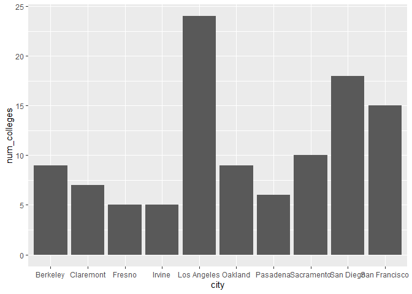
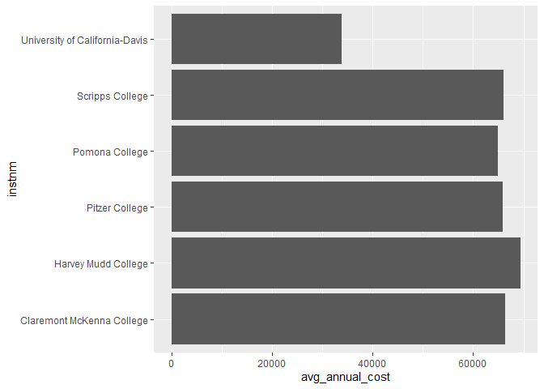
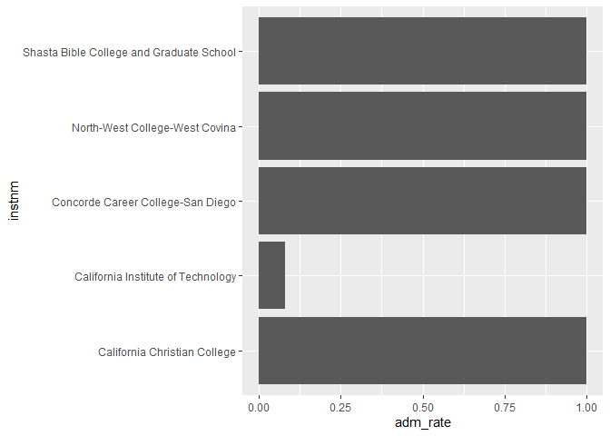
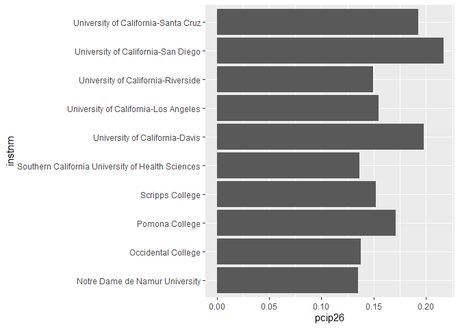

## Instructions
Answer the following questions and complete the exercises in RMarkdown. Please embed all of your code and push your final work to your repository. Your final lab report should be organized, clean, and run free from errors. Remember, you must remove the `#` for the included code chunks to run. Be sure to add your name to the author header above.  

Make sure to use the formatting conventions of RMarkdown to make your report neat and clean!  

## Load the libraries

```r
library(tidyverse)
library(janitor)
library(here)
library(naniar)
```

For this homework, we will take a departure from biological data and use data about California colleges. These data are a subset of the national college scorecard (https://collegescorecard.ed.gov/data/). Load the `ca_college_data.csv` as a new object called `colleges`.

```r
colleges <- read_csv("data/ca_college_data.csv") %>% clean_names()
```

```
## Rows: 341 Columns: 10
## ── Column specification ────────────────────────────────────────────────────────
## Delimiter: ","
## chr (4): INSTNM, CITY, STABBR, ZIP
## dbl (6): ADM_RATE, SAT_AVG, PCIP26, COSTT4_A, C150_4_POOLED, PFTFTUG1_EF
## 
## ℹ Use `spec()` to retrieve the full column specification for this data.
## ℹ Specify the column types or set `show_col_types = FALSE` to quiet this message.
```

```r
colleges
```

```
## # A tibble: 341 × 10
##    instnm      city  stabbr zip   adm_rate sat_avg pcip26 costt4_a c150_4_pooled
##    <chr>       <chr> <chr>  <chr>    <dbl>   <dbl>  <dbl>    <dbl>         <dbl>
##  1 Grossmont … El C… CA     9202…       NA      NA 0.0016     7956        NA    
##  2 College of… Visa… CA     9327…       NA      NA 0.0066     8109        NA    
##  3 College of… San … CA     9440…       NA      NA 0.0038     8278        NA    
##  4 Ventura Co… Vent… CA     9300…       NA      NA 0.0035     8407        NA    
##  5 Oxnard Col… Oxna… CA     9303…       NA      NA 0.0085     8516        NA    
##  6 Moorpark C… Moor… CA     9302…       NA      NA 0.0151     8577        NA    
##  7 Skyline Co… San … CA     9406…       NA      NA 0          8580         0.233
##  8 Glendale C… Glen… CA     9120…       NA      NA 0.002      9181        NA    
##  9 Citrus Col… Glen… CA     9174…       NA      NA 0.0021     9281        NA    
## 10 Fresno Cit… Fres… CA     93741       NA      NA 0.0324     9370        NA    
## # ℹ 331 more rows
## # ℹ 1 more variable: pftftug1_ef <dbl>
```

The variables are a bit hard to decipher, here is a key:  

INSTNM: Institution name  
CITY: California city  
STABBR: Location state  
ZIP: Zip code  
ADM_RATE: Admission rate  
SAT_AVG: SAT average score  
PCIP26: Percentage of degrees awarded in Biological And Biomedical Sciences  
COSTT4_A: Annual cost of attendance  
C150_4_POOLED: 4-year completion rate  
PFTFTUG1_EF: Percentage of undergraduate students who are first-time, full-time degree/certificate-seeking undergraduate students  

1. Use your preferred function(s) to have a look at the data and get an idea of its structure. Make sure you summarize NA's and determine whether or not the data are tidy. You may also consider dealing with any naming issues.

```r
summary(colleges)
```

```
##     instnm              city              stabbr              zip           
##  Length:341         Length:341         Length:341         Length:341        
##  Class :character   Class :character   Class :character   Class :character  
##  Mode  :character   Mode  :character   Mode  :character   Mode  :character  
##                                                                             
##                                                                             
##                                                                             
##                                                                             
##     adm_rate         sat_avg         pcip26           costt4_a    
##  Min.   :0.0807   Min.   : 870   Min.   :0.00000   Min.   : 7956  
##  1st Qu.:0.4581   1st Qu.: 985   1st Qu.:0.00000   1st Qu.:12578  
##  Median :0.6370   Median :1078   Median :0.00000   Median :16591  
##  Mean   :0.5901   Mean   :1112   Mean   :0.01981   Mean   :26685  
##  3rd Qu.:0.7461   3rd Qu.:1237   3rd Qu.:0.02457   3rd Qu.:39289  
##  Max.   :1.0000   Max.   :1555   Max.   :0.21650   Max.   :69355  
##  NA's   :240      NA's   :276    NA's   :35        NA's   :124    
##  c150_4_pooled     pftftug1_ef    
##  Min.   :0.0625   Min.   :0.0064  
##  1st Qu.:0.4265   1st Qu.:0.3212  
##  Median :0.5845   Median :0.5016  
##  Mean   :0.5705   Mean   :0.5577  
##  3rd Qu.:0.7162   3rd Qu.:0.8117  
##  Max.   :0.9569   Max.   :1.0000  
##  NA's   :221      NA's   :53
```


```r
head(colleges)
```

```
## # A tibble: 6 × 10
##   instnm       city  stabbr zip   adm_rate sat_avg pcip26 costt4_a c150_4_pooled
##   <chr>        <chr> <chr>  <chr>    <dbl>   <dbl>  <dbl>    <dbl>         <dbl>
## 1 Grossmont C… El C… CA     9202…       NA      NA 0.0016     7956            NA
## 2 College of … Visa… CA     9327…       NA      NA 0.0066     8109            NA
## 3 College of … San … CA     9440…       NA      NA 0.0038     8278            NA
## 4 Ventura Col… Vent… CA     9300…       NA      NA 0.0035     8407            NA
## 5 Oxnard Coll… Oxna… CA     9303…       NA      NA 0.0085     8516            NA
## 6 Moorpark Co… Moor… CA     9302…       NA      NA 0.0151     8577            NA
## # ℹ 1 more variable: pftftug1_ef <dbl>
```


```r
colleges %>%
  summarise_all(~ sum(is.na(.))) #very usefull 
```

```
## # A tibble: 1 × 10
##   instnm  city stabbr   zip adm_rate sat_avg pcip26 costt4_a c150_4_pooled
##    <int> <int>  <int> <int>    <int>   <int>  <int>    <int>         <int>
## 1      0     0      0     0      240     276     35      124           221
## # ℹ 1 more variable: pftftug1_ef <int>
```


2. Which cities in California have the highest number of colleges?


```r
colleges_city <- colleges %>%
  filter(stabbr == "CA") %>%
  group_by(city) %>%
  summarise(num_colleges = n()) %>%
  arrange(desc(num_colleges)) %>%
  head(10)
```

3. Based on your answer to #2, make a plot that shows the number of colleges in the top 10 cities.

```r
colleges_city %>%
ggplot(aes(x = num_colleges, y = city)) +
  geom_col() +
  coord_flip()
```

<!-- -->

4. The column `COSTT4_A` is the annual cost of each institution. Which city has the highest average cost? Where is it located?


```r
colleges_cost <- colleges %>%
  group_by(instnm) %>%
  mutate(avg_annual_cost = mean(costt4_a)) %>%
  arrange(desc(avg_annual_cost)) %>%
  head(5) %>%
  #inner_join(colleges, by = "instnm") %>%
  select(avg_annual_cost, city, stabbr)
```

```
## Adding missing grouping variables: `instnm`
```

```r
colleges_cost
```

```
## # A tibble: 5 × 4
## # Groups:   instnm [5]
##   instnm                                        avg_annual_cost city      stabbr
##   <chr>                                                   <dbl> <chr>     <chr> 
## 1 Harvey Mudd College                                     69355 Claremont CA    
## 2 Southern California Institute of Architecture           67225 Los Ange… CA    
## 3 University of Southern California                       67064 Los Ange… CA    
## 4 Occidental College                                      67046 Los Ange… CA    
## 5 Claremont McKenna College                               66325 Claremont CA
```

5. Based on your answer to #4, make a plot that compares the cost of the individual colleges in the most expensive city. Bonus! Add UC Davis here to see how it compares :>).

```r
colleges_cost_2 <- colleges %>%
  filter(city == "Claremont" | city == "Davis") %>%
  group_by(instnm) %>%
  mutate(avg_annual_cost = mean(costt4_a)) %>%
  filter(!is.na(avg_annual_cost)) %>%
  arrange(desc(avg_annual_cost)) %>%
  select(instnm, avg_annual_cost, city, stabbr)

colleges_cost_2
```

```
## # A tibble: 6 × 4
## # Groups:   instnm [6]
##   instnm                         avg_annual_cost city      stabbr
##   <chr>                                    <dbl> <chr>     <chr> 
## 1 Harvey Mudd College                      69355 Claremont CA    
## 2 Claremont McKenna College                66325 Claremont CA    
## 3 Scripps College                          66060 Claremont CA    
## 4 Pitzer College                           65880 Claremont CA    
## 5 Pomona College                           64870 Claremont CA    
## 6 University of California-Davis           33904 Davis     CA
```

```r
colleges_cost_2 %>%
  ggplot(aes(x = instnm, y = avg_annual_cost)) +
  geom_col() +
  coord_flip()
```

<!-- -->


6. The column `ADM_RATE` is the admissions rate by college and `C150_4_POOLED` is the four-year completion rate. Use a scatterplot to show the relationship between these two variables. What do you think this means?

```r
ggplot(data=colleges,
       mapping=aes(x=adm_rate, y=c150_4_pooled))+ 
  geom_point() 
```

```
## Warning: Removed 251 rows containing missing values (`geom_point()`).
```

<!-- -->

Using the data provided by the graph we can see that with decreasing admissions rate the four-year completion rate increases.  

7. Is there a relationship between cost and four-year completion rate? (You don't need to do the stats, just produce a plot). What do you think this means?

```r
ggplot(data=colleges,
       mapping=aes(x=costt4_a, y=c150_4_pooled))+ 
  geom_point() 
```

```
## Warning: Removed 225 rows containing missing values (`geom_point()`).
```

<!-- -->

I think that this graph shows a trend in which we see an increase in the four-year completion rate with the increasing cost, but it is not as strong as the one we see with the admissions rate. 

8. The column titled `INSTNM` is the institution name. We are only interested in the University of California colleges. Make a new data frame that is restricted to UC institutions. You can remove `Hastings College of Law` and `UC San Francisco` as we are only interested in undergraduate institutions.

```r
univ_calif_final <- colleges %>%
  filter(stabbr == "CA" & instnm != "Hastings College of Law" & instnm != "UC San Francisco")
univ_calif_final
```

```
## # A tibble: 339 × 10
##    instnm      city  stabbr zip   adm_rate sat_avg pcip26 costt4_a c150_4_pooled
##    <chr>       <chr> <chr>  <chr>    <dbl>   <dbl>  <dbl>    <dbl>         <dbl>
##  1 Grossmont … El C… CA     9202…       NA      NA 0.0016     7956        NA    
##  2 College of… Visa… CA     9327…       NA      NA 0.0066     8109        NA    
##  3 College of… San … CA     9440…       NA      NA 0.0038     8278        NA    
##  4 Ventura Co… Vent… CA     9300…       NA      NA 0.0035     8407        NA    
##  5 Oxnard Col… Oxna… CA     9303…       NA      NA 0.0085     8516        NA    
##  6 Moorpark C… Moor… CA     9302…       NA      NA 0.0151     8577        NA    
##  7 Skyline Co… San … CA     9406…       NA      NA 0          8580         0.233
##  8 Glendale C… Glen… CA     9120…       NA      NA 0.002      9181        NA    
##  9 Citrus Col… Glen… CA     9174…       NA      NA 0.0021     9281        NA    
## 10 Fresno Cit… Fres… CA     93741       NA      NA 0.0324     9370        NA    
## # ℹ 329 more rows
## # ℹ 1 more variable: pftftug1_ef <dbl>
```

Remove `Hastings College of Law` and `UC San Francisco` and store the final data frame as a new object `univ_calif_final`.

Use `separate()` to separate institution name into two new columns "UNIV" and "CAMPUS".

```r
univ_calif_final %>%
  separate(instnm, into=c("univ", "campus"), sep=" ")
```

```
## Warning: Expected 2 pieces. Additional pieces discarded in 264 rows [2, 3, 8, 10, 16,
## 17, 18, 20, 21, 22, 23, 24, 26, 29, 30, 31, 33, 36, 37, 40, ...].
```

```
## Warning: Expected 2 pieces. Missing pieces filled with `NA` in 3 rows [242,
## 243, 244].
```

```
## # A tibble: 339 × 11
##    univ      campus    city      stabbr zip     adm_rate sat_avg pcip26 costt4_a
##    <chr>     <chr>     <chr>     <chr>  <chr>      <dbl>   <dbl>  <dbl>    <dbl>
##  1 Grossmont College   El Cajon  CA     92020-…       NA      NA 0.0016     7956
##  2 College   of        Visalia   CA     93277-…       NA      NA 0.0066     8109
##  3 College   of        San Mateo CA     94402-…       NA      NA 0.0038     8278
##  4 Ventura   College   Ventura   CA     93003-…       NA      NA 0.0035     8407
##  5 Oxnard    College   Oxnard    CA     93033-…       NA      NA 0.0085     8516
##  6 Moorpark  College   Moorpark  CA     93021-…       NA      NA 0.0151     8577
##  7 Skyline   College   San Bruno CA     94066-…       NA      NA 0          8580
##  8 Glendale  Community Glendale  CA     91208-…       NA      NA 0.002      9181
##  9 Citrus    College   Glendora  CA     91741-…       NA      NA 0.0021     9281
## 10 Fresno    City      Fresno    CA     93741         NA      NA 0.0324     9370
## # ℹ 329 more rows
## # ℹ 2 more variables: c150_4_pooled <dbl>, pftftug1_ef <dbl>
```

9. The column `ADM_RATE` is the admissions rate by campus. Which UC has the lowest and highest admissions rates? Produce a numerical summary and an appropriate plot.

```r
univ_calif_final_1 <- univ_calif_final %>%
filter(!is.na(adm_rate)) %>%
  filter(adm_rate == min(adm_rate) | adm_rate == max(adm_rate)) %>%
  select(adm_rate, instnm) %>%
  arrange(desc(adm_rate))

univ_calif_final_1
```

```
## # A tibble: 5 × 2
##   adm_rate instnm                                  
##      <dbl> <chr>                                   
## 1   1      California Christian College            
## 2   1      Shasta Bible College and Graduate School
## 3   1      North-West College-West Covina          
## 4   1      Concorde Career College-San Diego       
## 5   0.0807 California Institute of Technology
```

```r
univ_calif_final_1 %>%
  ggplot(aes(x=instnm, y=adm_rate))+
  geom_col() + 
  coord_flip()
```

<!-- -->


10. If you wanted to get a degree in biological or biomedical sciences, which campus confers the majority of these degrees? Produce a numerical summary and an appropriate plot.

```r
univ_calif_final_2 <- univ_calif_final %>%
filter(!is.na(pcip26)) %>%
  select(pcip26, instnm) %>%
  arrange(desc(pcip26)) %>%
  head(10)

univ_calif_final_2
```

```
## # A tibble: 10 × 2
##    pcip26 instnm                                           
##     <dbl> <chr>                                            
##  1  0.216 University of California-San Diego               
##  2  0.198 University of California-Davis                   
##  3  0.193 University of California-Santa Cruz              
##  4  0.171 Pomona College                                   
##  5  0.155 University of California-Los Angeles             
##  6  0.152 Scripps College                                  
##  7  0.149 University of California-Riverside               
##  8  0.137 Occidental College                               
##  9  0.136 Southern California University of Health Sciences
## 10  0.135 Notre Dame de Namur University
```


```r
univ_calif_final_2 %>%
  ggplot(aes(x=instnm, y=pcip26))+
  geom_col() + 
  coord_flip()
```

<!-- -->


## Knit Your Output and Post to [GitHub](https://github.com/FRS417-DataScienceBiologists)
