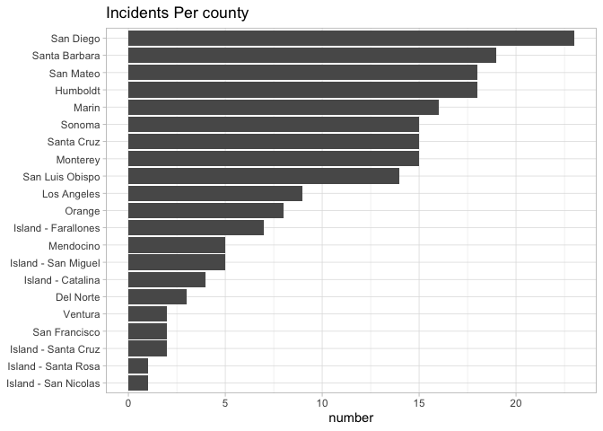
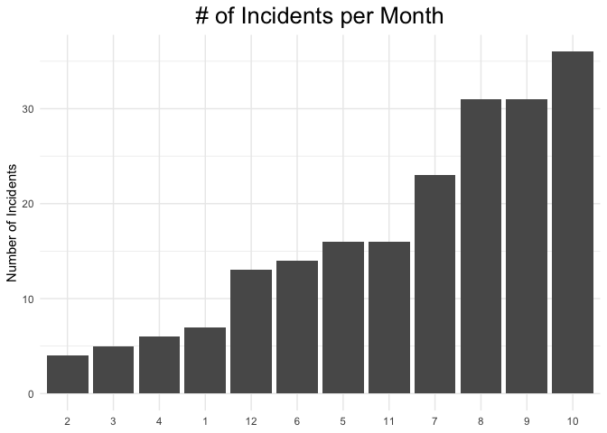
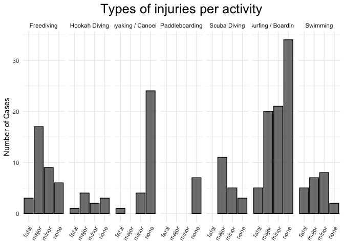
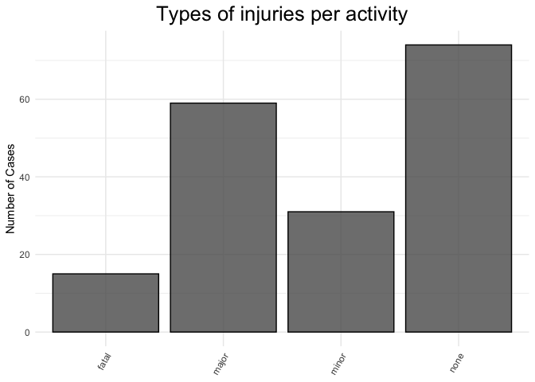
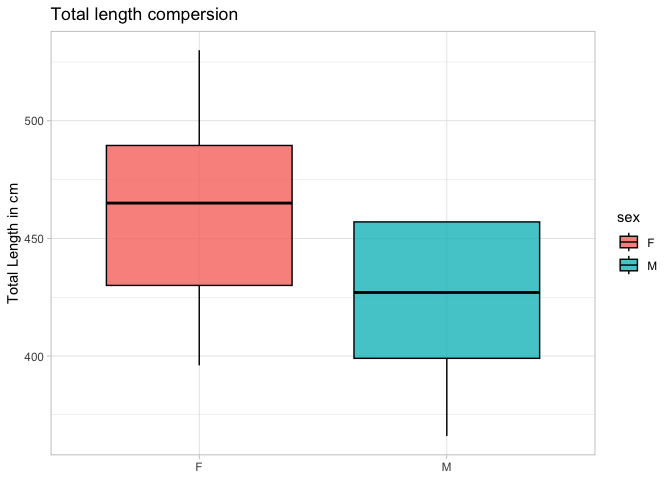
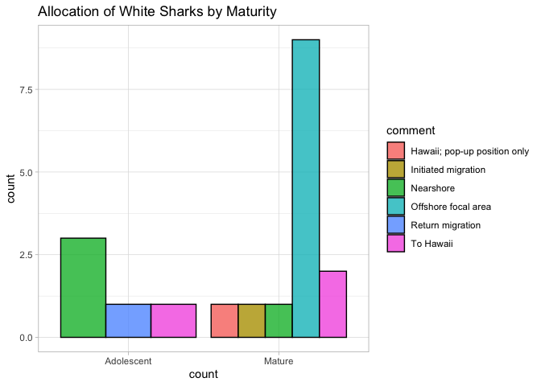

## Instructions
Answer the following questions and complete the exercises in RMarkdown. Please embed all of your code and push your final work to your repository. Your code must be organized, clean, and run free from errors. Remember, you must remove the `#` for any included code chunks to run. Be sure to add your name to the author header above. 

Your code must knit in order to be considered. If you are stuck and cannot answer a question, then comment out your code and knit the document. You may use your notes, labs, and homework to help you complete this exam. Do not use any other resources- including AI assistance.  

Don't forget to answer any questions that are asked in the prompt. Some questions will require a plot, but others do not- make sure to read each question carefully.  

For the questions that require a plot, make sure to have clearly labeled axes and a title. Keep your plots clean and professional-looking, but you are free to add color and other aesthetics.  

Be sure to follow the directions and upload your exam on Gradescope.    

## Background
In the `data` folder, you will find data about shark incidents in California between 1950-2022. The [data](https://catalog.data.gov/dataset/shark-incident-database-california-56167) are from: State of California- Shark Incident Database.   

## Load the libraries

```r
library("tidyverse")
library("janitor")
library("naniar")
```

## Load the data
Run the following code chunk to import the data.

```r
sharks <- read_csv("data/SharkIncidents_1950_2022_220302.csv") %>% clean_names()
```

## Questions
1. (1 point) Start by doing some data exploration using your preferred function(s). What is the structure of the data? Where are the missing values and how are they represented? 

```r
summary(sharks)
```

```
##  incident_num           month             day             year     
##  Length:211         Min.   : 1.000   Min.   : 1.00   Min.   :1950  
##  Class :character   1st Qu.: 6.000   1st Qu.: 7.50   1st Qu.:1985  
##  Mode  :character   Median : 8.000   Median :18.00   Median :2004  
##                     Mean   : 7.858   Mean   :16.54   Mean   :1998  
##                     3rd Qu.:10.000   3rd Qu.:25.00   3rd Qu.:2014  
##                     Max.   :12.000   Max.   :31.00   Max.   :2022  
##                                                                    
##      time              county            location             mode          
##  Length:211         Length:211         Length:211         Length:211        
##  Class :character   Class :character   Class :character   Class :character  
##  Mode  :character   Mode  :character   Mode  :character   Mode  :character  
##                                                                             
##                                                                             
##                                                                             
##                                                                             
##     injury             depth             species            comment         
##  Length:211         Length:211         Length:211         Length:211        
##  Class :character   Class :character   Class :character   Class :character  
##  Mode  :character   Mode  :character   Mode  :character   Mode  :character  
##                                                                             
##                                                                             
##                                                                             
##                                                                             
##   longitude            latitude     confirmed_source   wfl_case_number   
##  Length:211         Min.   :32.59   Length:211         Length:211        
##  Class :character   1st Qu.:34.04   Class :character   Class :character  
##  Mode  :character   Median :36.70   Mode  :character   Mode  :character  
##                     Mean   :36.36                                        
##                     3rd Qu.:38.18                                        
##                     Max.   :41.56                                        
##                     NA's   :6
```


2. (1 point) Notice that there are some incidents identified as "NOT COUNTED". These should be removed from the data because they were either not sharks, unverified, or were provoked. It's OK to replace the `sharks` object.

```r
sharks <- sharks %>%
  filter(incident_num != "NOT COUNTED")
```


3. (3 points) Are there any "hotspots" for shark incidents in California? Make a plot that shows the total number of incidents per county. Which county has the highest number of incidents?

```r
sharks %>%
  count(county) %>%
  ggplot(aes(x=reorder(county, n), y=n))+
  geom_col()+
  coord_flip()+
  
  labs(title="Incidents Per county",
       x=NULL,
       y="number")+
  theme_light()
```

<!-- -->


4. (3 points) Are there months of the year when incidents are more likely to occur? Make a plot that shows the total number of incidents by month. Which month has the highest number of incidents?  


```r
sharks %>%
  mutate(year==as.factor(year)) %>%
  count(month) %>%
  pivot_wider(names_from = month, values_from = n)
```

```
## # A tibble: 1 × 12
##     `1`   `2`   `3`   `4`   `5`   `6`   `7`   `8`   `9`  `10`  `11`  `12`
##   <int> <int> <int> <int> <int> <int> <int> <int> <int> <int> <int> <int>
## 1     7     4     5     6    16    14    23    31    31    36    16    13
```


```r
sharks %>%
  mutate(year==as.factor(month)) %>%
  count(month) %>%
  ggplot(aes(x=reorder(month, n), y=n))+
  geom_col()+
  
  theme_minimal()+
  theme(plot.title=element_text(size = rel(1.75), hjus=0.5))+
  labs(x = NULL,
       y = "Number of Incidents", 
       title = "# of Incidents per Month")
```

<!-- -->


5. (3 points) How do the number and types of injuries compare by county? Make a table (not a plot) that shows the number of injury types by county. Which county has the highest number of fatalities?  

```r
sharks %>%
  filter(injury!="none"| injury!= "none*") %>%
  group_by(county) %>%
  count(injury) %>%
  arrange(n)
```

```
## # A tibble: 57 × 3
## # Groups:   county [21]
##    county               injury     n
##    <chr>                <chr>  <int>
##  1 Del Norte            none       1
##  2 Island - Catalina    minor      1
##  3 Island - San Miguel  fatal      1
##  4 Island - San Nicolas minor      1
##  5 Island - Santa Cruz  minor      1
##  6 Island - Santa Cruz  none       1
##  7 Island - Santa Rosa  major      1
##  8 Los Angeles          fatal      1
##  9 Mendocino            fatal      1
## 10 Mendocino            minor      1
## # ℹ 47 more rows
```


6. (2 points) In the data, `mode` refers to a type of activity. Which activity is associated with the highest number of incidents?

```r
sharks %>%
  count(mode) %>%
  arrange(desc(n)) %>%
  head(1)
```

```
## # A tibble: 1 × 2
##   mode                   n
##   <chr>              <int>
## 1 Surfing / Boarding    80
```


7. (4 points) Use faceting to make a plot that compares the number and types of injuries by activity. (hint: the x axes should be the type of injury) 

```r
sharks %>%
  group_by(injury) %>%
  ggplot(aes(x=injury))+
  geom_bar(alpha=0.8, color="black")+
  facet_grid(~mode)+
  
  theme_minimal()+
  theme(plot.title=element_text(size = rel(1.75), hjus=0.5))+
  labs(x = NULL,
       y = "Number of Cases", 
       title = "Types of injuries per activity") +
  theme(axis.text.x = element_text(angle = 60, hjust = 1))
```

<!-- -->


8. (1 point) Which shark species is involved in the highest number of incidents?  


```r
sharks %>%
  count(species)%>%
  arrange(desc(n)) %>%
  head(1)
```

```
## # A tibble: 1 × 2
##   species     n
##   <chr>   <int>
## 1 White     179
```

9. (3 points) Are all incidents involving Great White's fatal? Make a plot that shows the number and types of injuries for Great White's only.  

```r
sharks %>%
  filter(species == "White") %>%
  group_by(injury) %>%
  ggplot(aes(x=injury))+
  geom_bar(alpha=0.8, color="black")+
  
  theme_minimal()+
  theme(plot.title=element_text(size = rel(1.75), hjus=0.5))+
  labs(x = NULL,
       y = "Number of Cases", 
       title = "Types of injuries per activity") +
  theme(axis.text.x = element_text(angle = 60, hjust = 1))
```

<!-- -->


## Background
Let's learn a little bit more about Great White sharks by looking at a small dataset that tracked 20 Great White's in the Fallaron Islands. The [data](https://link.springer.com/article/10.1007/s00227-007-0739-4) are from: Weng et al. (2007) Migration and habitat of white sharks (_Carcharodon carcharias_) in the eastern Pacific Ocean.

## Load the data

```r
white_sharks <- read_csv("data/White sharks tracked from Southeast Farallon Island, CA, USA, 1999 2004.csv", na = c("?", "n/a")) %>% clean_names()
```

10. (1 point) Start by doing some data exploration using your preferred function(s). What is the structure of the data? Where are the missing values and how are they represented?

```r
summary(white_sharks)
```

```
##     shark           tagging_date       total_length_cm     sex           
##  Length:20          Length:20          Min.   :360.0   Length:20         
##  Class :character   Class :character   1st Qu.:400.5   Class :character  
##  Mode  :character   Mode  :character   Median :434.5   Mode  :character  
##                                        Mean   :436.1                     
##                                        3rd Qu.:457.0                     
##                                        Max.   :530.0                     
##                                                                          
##    maturity         pop_up_date          track_days      longitude     
##  Length:20          Length:20          Min.   : 14.0   Min.   :-156.8  
##  Class :character   Class :character   1st Qu.: 85.0   1st Qu.:-137.8  
##  Mode  :character   Mode  :character   Median :182.0   Median :-133.2  
##                                        Mean   :166.8   Mean   :-120.3  
##                                        3rd Qu.:216.8   3rd Qu.:-124.3  
##                                        Max.   :367.0   Max.   : 131.7  
##                                                        NA's   :1       
##     latitude       comment         
##  Min.   :20.67   Length:20         
##  1st Qu.:22.48   Class :character  
##  Median :26.39   Mode  :character  
##  Mean   :28.24                     
##  3rd Qu.:36.00                     
##  Max.   :38.95                     
##  NA's   :1
```


```r
glimpse(white_sharks)
```

```
## Rows: 20
## Columns: 10
## $ shark           <chr> "1-M", "2-M", "3-M", "4-M", "5-F", "6-M", "7-F", "8-M"…
## $ tagging_date    <chr> "19-Oct-99", "30-Oct-99", "16-Oct-00", "5-Nov-01", "5-…
## $ total_length_cm <dbl> 402, 366, 457, 457, 488, 427, 442, 380, 450, 530, 427,…
## $ sex             <chr> "M", "M", "M", "M", "F", "M", "F", "M", "M", "F", NA, …
## $ maturity        <chr> "Mature", "Adolescent", "Mature", "Mature", "Mature", …
## $ pop_up_date     <chr> "2-Nov-99", "25-Nov-99", "16-Apr-01", "6-May-02", "19-…
## $ track_days      <dbl> 14, 26, 182, 182, 256, 275, 35, 60, 209, 91, 182, 240,…
## $ longitude       <dbl> -124.49, -125.97, -156.80, -141.47, -133.25, -138.83, …
## $ latitude        <dbl> 38.95, 38.69, 20.67, 26.39, 21.13, 26.50, 37.07, 34.93…
## $ comment         <chr> "Nearshore", "Nearshore", "To Hawaii", "To Hawaii", "O…
```


```r
miss_var_summary(white_sharks)
```

```
## # A tibble: 10 × 3
##    variable        n_miss pct_miss
##    <chr>            <int>    <dbl>
##  1 sex                  3       15
##  2 maturity             1        5
##  3 longitude            1        5
##  4 latitude             1        5
##  5 shark                0        0
##  6 tagging_date         0        0
##  7 total_length_cm      0        0
##  8 pop_up_date          0        0
##  9 track_days           0        0
## 10 comment              0        0
```


11. (3 points) How do male and female sharks compare in terms of total length? Are males or females larger on average? Do a quick search online to verify your findings. (hint: this is a table, not a plot).  

```r
white_sharks %>%
  filter(sex != "NA") %>%
  group_by(sex) %>%
  summarise(mean_length=mean(total_length_cm)) %>% 
  arrange(desc(mean_length))
```

```
## # A tibble: 2 × 2
##   sex   mean_length
##   <chr>       <dbl>
## 1 F            462 
## 2 M            425.
```

On the interent I confimed that the average total length of femal sharks is bigger.
The [data](https://ocean.si.edu/ocean-life/sharks-rays/how-big-are-great-white-sharks#:~:text=That's%20the%20size%20of%20the,males%20reach%2011%2D13%20feet.)


12. (3 points) Make a plot that compares the range of total length by sex.

```r
white_sharks %>%
  filter(sex != "NA") %>%
  group_by(sex) %>%
  ggplot(aes(x=sex, y=total_length_cm, fill = sex))+
  geom_boxplot(na.rm=T, alpha=0.8, color="black")+
  
  labs(title="Total length compersion",
       x=NULL,
       y="Total Length in cm")+
  theme_light()
```

<!-- -->


13. (2 points) Using the `sharks` or the `white_sharks` data, what is one question that you are interested in exploring? Write the question and answer it using a plot or table.
Is which locations do mature white sharks are found the most frequnt and in which the adulsent?

```r
white_sharks %>%
  filter(maturity != "NA") %>%
  group_by(sex) %>%
  ggplot(aes(x=maturity, fill = comment))+
  geom_bar(na.rm=T, alpha=0.8, color="black", position = "dodge")+
  
  labs(title="Allocation of White Sharks by Maturity",
       x="count")+
  theme_light()
```

<!-- -->


